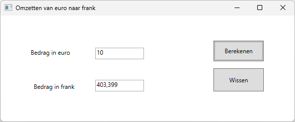

# Introductie 1: Euro omzetten naar Belgische frank
Deze oefening dient om een bedrag in euro om te zetten naar Belgische
frank.

## Layout

Er is een tekstvak *eurTextBox* om een bedrag in te geven en een tekstvak
*frankTextBox* om het resultaat te tonen.

Er is een opdrachtknop *convertButton* en een opdrachtknop *clearButton*.

## Functionaliteit
- Met de knop Berekenen wordt het bedrag in euro omgezet naar Belgische frank.
- Met de knop Wissen worden de tekstvakken leeg gemaakt.

## Tips
- gebruik een constante *exchangeRate* met de waarde 40.3399 die de koers bepaalt
